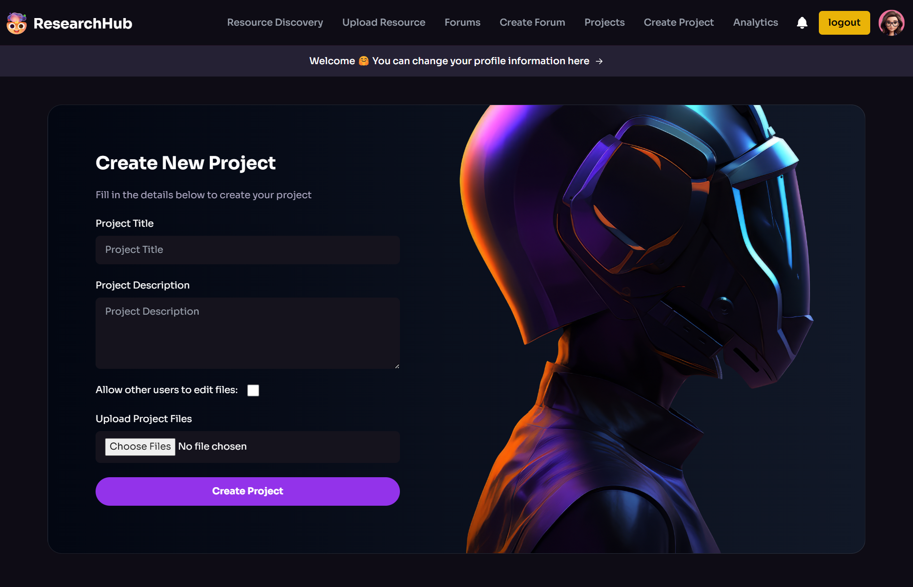

# ResearchHub

## Project Domain / Category
**Web Application**

## Abstract / Introduction
**ResearchHub** is a web application designed to facilitate collaboration and knowledge sharing among researchers, academics, and students. It provides a platform for users to upload, share, discuss, and discover research papers, articles, datasets, and other scholarly resources.

## Functional Requirements

### 1. User Registration and Authentication
- Users can register accounts and log in securely.
- Implements authentication mechanisms such as email verification and password hashing to ensure user data security.

### 2. Admin Dashboard
- An admin dashboard for managing users, content moderation, enforcing community guidelines, and monitoring platform activity.

### 3. Profile Management
- Users can create and manage their profiles, including features such as profile pictures, bio descriptions, affiliations, and research interests.

### 4. Resource Upload and Sharing
- Users can upload research papers, articles, datasets, presentations, and other scholarly resources.
- Supports file upload functionality with various file formats.

### 5. Resource Discovery
- Search functionality for users to discover relevant research resources.
- Search filters based on keywords, authors, categories, publication dates, and citation metrics.

### 6. Discussion Forums
- Discussion forums for scholarly discussions, questions, insights, and collaboration on research topics.
- Features include threaded comments, upvoting/downvoting, and tagging.

### 7. Collaborative Projects
- Users can create and join collaborative research projects.
- Each project has its own discussion forum, document repository, task board, and timeline for milestones.

### 8. Social Networking Features
- Social networking features such as following/followers, user mentions, and notifications to keep users engaged and connected with their peers.

### 9. Analytics and Reporting
- Analytics dashboards for users to track metrics related to their research contributions, including download counts, citation counts, and user engagement statistics.

## 🛠️ Tech Stack
- **Frontend**: HTML, CSS, JavaScript
- **Backend**: PHP
- **Database**: MySQL

## 👨‍💻 Developer

**Rehman**  

Feel free to connect with me on [LinkedIn](https://www.linkedin.com/in/rehman-nry)!
